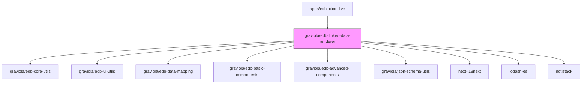

# @graviola/edb-linked-data-renderer

Specialized JSON Forms renderers for working with linked data in the Graviola framework.


## Overview

This package provides a collection of JSON Forms renderers specifically designed for working with linked data (JSON-LD). It enables the creation of rich, interactive forms for editing and displaying linked data objects, arrays of linked items, and semantic relationships between entities.

## Ecosystem Integration

### Position in the Graviola Framework

The linked-data-renderer package is a core UI component in the Graviola framework's form rendering system. It bridges the gap between the JSON Forms library and semantic web technologies by providing specialized renderers for JSON-LD data structures. This package is essential for applications that need to edit and display linked data with proper semantic context.

### Dependency Graph



### Package Relationships

- **Dependencies**:

  - `@graviola/edb-core-utils`: Provides utility functions for working with IRIs and paths
  - `@graviola/edb-ui-utils`: Provides UI utility functions
  - `@graviola/edb-data-mapping`: Provides data mapping functions for linked data
  - `@graviola/edb-basic-components`: Provides basic UI components
  - `@graviola/edb-advanced-components`: Provides advanced UI components
  - `@graviola/json-schema-utils`: Provides utilities for working with JSON Schema
  - `next-i18next`: Used for internationalization
  - `lodash-es`: Provides utility functions
  - `notistack`: Provides snackbar notifications
  - `json-schema`: JSON Schema definitions
  - `json-schema-to-ts`: Type generation from JSON Schema

- **Peer Dependencies**:

  - `@graviola/edb-state-hooks`: For state management
  - `@mui/material`, `@mui/icons-material`: Material UI components
  - `@ebay/nice-modal-react`: Modal management
  - `@jsonforms/material-renderers`, `@jsonforms/core`, `@jsonforms/react`: JSON Forms library
  - `react`: React library
  - `ajv`: JSON Schema validation

- **Used By**:
  - `apps/exhibition-live`: Uses the linked data renderers in its form configuration

## Installation

```bash
bun add @graviola/edb-linked-data-renderer
# or
npm install @graviola/edb-linked-data-renderer
# or
yarn add @graviola/edb-linked-data-renderer
```

## Features

- **MaterialLinkedObjectRenderer**: Renders a linked object with its properties
- **MaterialArrayOfLinkedItemRenderer**: Renders an array of linked items
- **MaterialArrayOfLinkedItemChipsRenderer**: Renders an array of linked items as chips
- **InlineCondensedSemanticFormsRenderer**: Renders a condensed form for linked data
- **InlineDropdownRenderer**: Renders a dropdown for selecting linked data
- **InlineDropdownSemanticFormsRenderer**: Renders a dropdown with semantic forms
- **SemanticFormsInline**: Renders a semantic form inline
- **SemanticFormsModal**: Renders a semantic form in a modal
- **SimpleExpandPanelRenderer**: Renders an expandable panel for linked items
- **SimpleChipRenderer**: Renders a chip for a linked item

## Usage

### Basic Usage

To use the linked data renderers, register them with the JSON Forms renderer registry:

```typescript
import {
  MaterialLinkedObjectRenderer,
  materialLinkedObjectControlTester,
  MaterialArrayOfLinkedItemRenderer,
  materialArrayOfLinkedItemTester,
  MaterialArrayOfLinkedItemChipsRenderer,
  materialArrayChipsLayoutTester,
  InlineCondensedSemanticFormsRenderer,
  inlineCondensedSemanticFormsTester,
  InlineDropdownRenderer,
  inlineDropdownTester
} from '@graviola/edb-linked-data-renderer';
import { JsonFormsRendererRegistryEntry } from '@jsonforms/core';

// Create a renderer registry
const renderers: JsonFormsRendererRegistryEntry[] = [
  // Register the linked object renderer
  {
    tester: materialLinkedObjectControlTester,
    renderer: MaterialLinkedObjectRenderer
  },
  // Register the array of linked items renderer
  {
    tester: materialArrayOfLinkedItemTester,
    renderer: MaterialArrayOfLinkedItemRenderer
  },
  // Register the array of linked items chips renderer
  {
    tester: materialArrayChipsLayoutTester,
    renderer: MaterialArrayOfLinkedItemChipsRenderer
  },
  // Register the inline condensed semantic forms renderer
  {
    tester: inlineCondensedSemanticFormsTester,
    renderer: InlineCondensedSemanticFormsRenderer
  },
  // Register the inline dropdown renderer
  {
    tester: inlineDropdownTester,
    renderer: InlineDropdownRenderer
  }
];

// Use the renderers with JsonForms
import { JsonForms } from '@jsonforms/react';

const MyForm = ({ data, schema, uischema, onChange }) => (
  <JsonForms
    data={data}
    schema={schema}
    uischema={uischema}
    renderers={renderers}
    onChange={onChange}
  />
);
```

### JSON Schema Example for Linked Data

Here's an example of a JSON Schema for a linked data object:

```json
{
  "type": "object",
  "properties": {
    "@id": {
      "type": "string",
      "format": "iri"
    },
    "@type": {
      "type": "string",
      "const": "http://example.org/Person"
    },
    "name": {
      "type": "string"
    },
    "friends": {
      "type": "array",
      "items": {
        "$ref": "#/definitions/Person"
      }
    }
  },
  "required": ["@id", "@type", "name"],
  "definitions": {
    "Person": {
      "type": "object",
      "properties": {
        "@id": {
          "type": "string",
          "format": "iri"
        },
        "@type": {
          "type": "string",
          "const": "http://example.org/Person"
        },
        "name": {
          "type": "string"
        }
      },
      "required": ["@id", "@type", "name"]
    }
  }
}
```

### UI Schema Example for Linked Data

Here's an example of a UI Schema for a linked data object:

```json
{
  "type": "VerticalLayout",
  "elements": [
    {
      "type": "Control",
      "scope": "#/properties/name"
    },
    {
      "type": "Control",
      "scope": "#/properties/friends",
      "options": {
        "elementLabelProp": "name",
        "elementLabelTemplate": "{{name}}",
        "isReifiedStatement": true
      }
    }
  ]
}
```

## Advanced Features

### Reified Statements

The `MaterialArrayLayout` supports reified statements, which allow you to add metadata to relationships between entities. When the `isReifiedStatement` option is set to `true`, the renderer will display an inline form for adding new items to the array:

```json
{
  "type": "Control",
  "scope": "#/properties/friends",
  "options": {
    "isReifiedStatement": true
  }
}
```

### Custom Label Templates

You can customize how linked items are displayed using the `elementLabelTemplate` option:

```json
{
  "type": "Control",
  "scope": "#/properties/friends",
  "options": {
    "elementLabelTemplate": "{{name}} ({{email}})"
  }
}
```

### Ordering Items

You can specify how linked items should be ordered using the `orderBy` option:

```json
{
  "type": "Control",
  "scope": "#/properties/friends",
  "options": {
    "orderBy": "name"
  }
}
```

## Internal Usage

This package is used in the Graviola framework to render linked data forms in applications like the exhibition-live app. Here's an example from the rendererRegistry.ts file:

```typescript
// From apps/exhibition-live/components/config/rendererRegistry.ts
import {
  InlineCondensedSemanticFormsRenderer,
  InlineDropdownRenderer,
  materialArrayChipsLayoutTester,
  MaterialArrayOfLinkedItemChipsRenderer,
  MaterialArrayOfLinkedItemRenderer,
  materialLinkedObjectControlTester,
  MaterialLinkedObjectRenderer,
} from "@graviola/edb-linked-data-renderer";

export const rendererRegistry: JsonFormsRendererRegistryEntry[] = [
  // ... other renderers
  {
    tester: materialLinkedObjectControlTester,
    renderer: MaterialLinkedObjectRenderer,
  },
  // ... other renderers
];
```

## API Reference

### MaterialLinkedObjectRenderer

A renderer for linked objects that displays their properties.

### MaterialArrayOfLinkedItemRenderer

A renderer for arrays of linked items that displays them in a list.

### MaterialArrayOfLinkedItemChipsRenderer

A renderer for arrays of linked items that displays them as chips.

### InlineCondensedSemanticFormsRenderer

A renderer for condensed semantic forms that can be embedded inline.

### InlineDropdownRenderer

A renderer for dropdowns that allow selecting linked data items.

### SemanticFormsInline

A component for rendering semantic forms inline.

### SemanticFormsModal

A component for rendering semantic forms in a modal dialog.

### SimpleExpandPanelRenderer

A component for rendering expandable panels for linked items.

### SimpleChipRenderer

A component for rendering chips for linked items.

## License

This package is part of the Graviola project. - `json-schema`: JSON Schema definitions

- `json-schema-to-ts`: Type generation from JSON Schema

- **Peer Dependencies**:

  - `@graviola/edb-state-hooks`: For state management
  - `@mui/material`, `@mui/icons-material`: Material UI components
  - `@ebay/nice-modal-react`: Modal management
  - `@jsonforms/material-renderers`, `@jsonforms/core`, `@jsonforms/react`: JSON Forms library
  - `react`: React library
  - `ajv`: JSON Schema validation

- **Used By**:
  - `apps/exhibition-live`: Uses the linked data renderers in its form configuration

## Installation

```bash
bun add @graviola/edb-linked-data-renderer
# or
npm install @graviola/edb-linked-data-renderer
# or
yarn add @graviola/edb-linked-data-renderer
```

## Features

- **MaterialLinkedObjectRenderer**: Renders a linked object with its properties
- **MaterialArrayOfLinkedItemRenderer**: Renders an array of linked items
- **MaterialArrayOfLinkedItemChipsRenderer**: Renders an array of linked items as chips
- **InlineCondensedSemanticFormsRenderer**: Renders a condensed form for linked data
- **InlineDropdownRenderer**: Renders a dropdown for selecting linked data
- **InlineDropdownSemanticFormsRenderer**: Renders a dropdown with semantic forms
- **SemanticFormsInline**: Renders a semantic form inline
- **SemanticFormsModal**: Renders a semantic form in a modal
- **SimpleExpandPanelRenderer**: Renders an expandable panel for linked items
- **SimpleChipRenderer**: Renders a chip for a linked item

## Usage

### Basic Usage

To use the linked data renderers, register them with the JSON Forms renderer registry:

```typescript
import {
  MaterialLinkedObjectRenderer,
  materialLinkedObjectControlTester,
  MaterialArrayOfLinkedItemRenderer,
  materialArrayOfLinkedItemTester,
  MaterialArrayOfLinkedItemChipsRenderer,
  materialArrayChipsLayoutTester,
  InlineCondensedSemanticFormsRenderer,
  inlineCondensedSemanticFormsTester,
  InlineDropdownRenderer,
  inlineDropdownTester
} from '@graviola/edb-linked-data-renderer';
import { JsonFormsRendererRegistryEntry } from '@jsonforms/core';

// Create a renderer registry
const renderers: JsonFormsRendererRegistryEntry[] = [
  // Register the linked object renderer
  {
    tester: materialLinkedObjectControlTester,
    renderer: MaterialLinkedObjectRenderer
  },
  // Register the array of linked items renderer
  {
    tester: materialArrayOfLinkedItemTester,
    renderer: MaterialArrayOfLinkedItemRenderer
  },
  // Register the array of linked items chips renderer
  {
    tester: materialArrayChipsLayoutTester,
    renderer: MaterialArrayOfLinkedItemChipsRenderer
  },
  // Register the inline condensed semantic forms renderer
  {
    tester: inlineCondensedSemanticFormsTester,
    renderer: InlineCondensedSemanticFormsRenderer
  },
  // Register the inline dropdown renderer
  {
    tester: inlineDropdownTester,
    renderer: InlineDropdownRenderer
  }
];

// Use the renderers with JsonForms
import { JsonForms } from '@jsonforms/react';

const MyForm = ({ data, schema, uischema, onChange }) => (
  <JsonForms
    data={data}
    schema={schema}
    uischema={uischema}
    renderers={renderers}
    onChange={onChange}
  />
);
```

### JSON Schema Example for Linked Data

Here's an example of a JSON Schema for a linked data object:

```json
{
  "type": "object",
  "properties": {
    "@id": {
      "type": "string",
      "format": "iri"
    },
    "@type": {
      "type": "string",
      "const": "http://example.org/Person"
    },
    "name": {
      "type": "string"
    },
    "friends": {
      "type": "array",
      "items": {
        "$ref": "#/definitions/Person"
      }
    }
  },
  "required": ["@id", "@type", "name"],
  "definitions": {
    "Person": {
      "type": "object",
      "properties": {
        "@id": {
          "type": "string",
          "format": "iri"
        },
        "@type": {
          "type": "string",
          "const": "http://example.org/Person"
        },
        "name": {
          "type": "string"
        }
      },
      "required": ["@id", "@type", "name"]
    }
  }
}
```

### UI Schema Example for Linked Data

Here's an example of a UI Schema for a linked data object:

```json
{
  "type": "VerticalLayout",
  "elements": [
    {
      "type": "Control",
      "scope": "#/properties/name"
    },
    {
      "type": "Control",
      "scope": "#/properties/friends",
      "options": {
        "elementLabelProp": "name",
        "elementLabelTemplate": "{{name}}",
        "isReifiedStatement": true
      }
    }
  ]
}
```

## Advanced Features

### Reified Statements

The `MaterialArrayLayout` supports reified statements, which allow you to add metadata to relationships between entities. When the `isReifiedStatement` option is set to `true`, the renderer will display an inline form for adding new items to the array:

```json
{
  "type": "Control",
  "scope": "#/properties/friends",
  "options": {
    "isReifiedStatement": true
  }
}
```

### Custom Label Templates

You can customize how linked items are displayed using the `elementLabelTemplate` option:

```json
{
  "type": "Control",
  "scope": "#/properties/friends",
  "options": {
    "elementLabelTemplate": "{{name}} ({{email}})"
  }
}
```

### Ordering Items

You can specify how linked items should be ordered using the `orderBy` option:

```json
{
  "type": "Control",
  "scope": "#/properties/friends",
  "options": {
    "orderBy": "name"
  }
}
```

## Internal Usage

This package is used in the Graviola framework to render linked data forms in applications like the exhibition-live app. Here's an example from the rendererRegistry.ts file:

```typescript
// From apps/exhibition-live/components/config/rendererRegistry.ts
import {
  InlineCondensedSemanticFormsRenderer,
  InlineDropdownRenderer,
  materialArrayChipsLayoutTester,
  MaterialArrayOfLinkedItemChipsRenderer,
  MaterialArrayOfLinkedItemRenderer,
  materialLinkedObjectControlTester,
  MaterialLinkedObjectRenderer,
} from "@graviola/edb-linked-data-renderer";

export const rendererRegistry: JsonFormsRendererRegistryEntry[] = [
  // ... other renderers
  {
    tester: materialLinkedObjectControlTester,
    renderer: MaterialLinkedObjectRenderer,
  },
  // ... other renderers
];
```

## API Reference

### MaterialLinkedObjectRenderer

A renderer for linked objects that displays their properties.

### MaterialArrayOfLinkedItemRenderer

A renderer for arrays of linked items that displays them in a list.

### MaterialArrayOfLinkedItemChipsRenderer

A renderer for arrays of linked items that displays them as chips.

### InlineCondensedSemanticFormsRenderer

A renderer for condensed semantic forms that can be embedded inline.

### InlineDropdownRenderer

A renderer for dropdowns that allow selecting linked data items.

### SemanticFormsInline

A component for rendering semantic forms inline.

### SemanticFormsModal

A component for rendering semantic forms in a modal dialog.

### SimpleExpandPanelRenderer

A component for rendering expandable panels for linked items.

### SimpleChipRenderer

A component for rendering chips for linked items.

## License

This package is part of the Graviola project.
