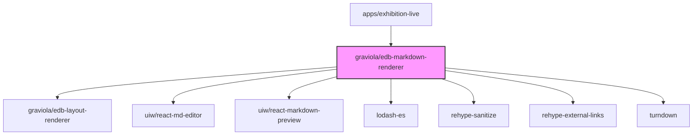

# @graviola/edb-markdown-renderer

A Markdown editor and renderer for JSON Forms in the Graviola framework.


## Overview

This package provides specialized JSON Forms renderers for editing and displaying Markdown content. It integrates with @uiw/react-md-editor to offer a rich Markdown editing experience with preview capabilities, making it ideal for description fields, documentation, and other text-heavy content.

## Ecosystem Integration

### Position in the Graviola Framework

The markdown-renderer package extends the form rendering capabilities of the Graviola framework by providing specialized components for Markdown content. It enables users to edit and preview Markdown directly within forms, enhancing the content authoring experience for rich text.

### Dependency Graph



### Package Relationships

- **Dependencies**:

  - `@graviola/edb-layout-renderer`: Provides layout components used by the markdown renderer
  - `@uiw/react-md-editor`: The core Markdown editor component
  - `@uiw/react-markdown-preview`: Used for previewing Markdown content
  - `lodash-es`: Provides utility functions
  - `rehype-sanitize`: Sanitizes HTML in Markdown preview for security
  - `rehype-external-links`: Adds target="\_blank" to external links in Markdown preview
  - `turndown`: Converts HTML to Markdown when pasting content

- **Peer Dependencies**:
  - `next`: Next.js framework for dynamic imports
  - `@jsonforms/react`, `@jsonforms/core`, `@jsonforms/material-renderers`: JSON Forms library
  - `@mui/material`, `@mui/icons-material`: Material UI components
  - `react`: React library

## Installation

```bash
bun add @graviola/edb-markdown-renderer
# or
npm install @graviola/edb-markdown-renderer
# or
yarn add @graviola/edb-markdown-renderer
```

## Features

- **MarkdownTextFieldRenderer**: A JSON Forms renderer for Markdown text fields
- **MDEditor**: A wrapper around @uiw/react-md-editor with dynamic importing for Next.js compatibility
- **MDEditorMarkdown**: A wrapper around @uiw/react-markdown-preview for rendering Markdown
- **Toggle Between Edit and Preview**: Users can switch between editing and previewing Markdown
- **HTML to Markdown Conversion**: Automatically converts HTML to Markdown when pasting content
- **Security**: Sanitizes HTML in Markdown preview to prevent XSS attacks
- **External Links**: Automatically adds target="\_blank" to external links in Markdown preview

## Usage

### Basic Usage with MarkdownTextFieldRenderer

To use the MarkdownTextFieldRenderer in your JSON Forms application:

```typescript
import {
  MarkdownTextFieldRenderer
} from '@graviola/edb-markdown-renderer';
import { JsonFormsRendererRegistryEntry, rankWith, scopeEndsWith } from '@jsonforms/core';

// Create a renderer registry
const renderers: JsonFormsRendererRegistryEntry[] = [
  // Register the Markdown renderer for description fields
  {
    tester: rankWith(10, scopeEndsWith("description")),
    renderer: MarkdownTextFieldRenderer
  }
];

// Use the renderers with JsonForms
import { JsonForms } from '@jsonforms/react';

const MyForm = ({ data, schema, uischema, onChange }) => (
  <JsonForms
    data={data}
    schema={schema}
    uischema={uischema}
    renderers={renderers}
    onChange={onChange}
  />
);
```

### JSON Schema Example

```json
{
  "type": "object",
  "properties": {
    "title": {
      "type": "string",
      "title": "Title"
    },
    "description": {
      "type": "string",
      "title": "Description"
    }
  }
}
```

### UI Schema Example

```json
{
  "type": "VerticalLayout",
  "elements": [
    {
      "type": "Control",
      "scope": "#/properties/title"
    },
    {
      "type": "Control",
      "scope": "#/properties/description"
    }
  ]
}
```

### Using MDEditor Directly

You can also use the MDEditor component directly in your React components:

```tsx
import { MDEditor, MDEditorMarkdown } from "@graviola/edb-markdown-renderer";
import React, { useState } from "react";

const MyMarkdownEditor = () => {
  const [value, setValue] = useState<string>("# Hello, world!");
  const [editMode, setEditMode] = useState<boolean>(true);

  return (
    <div>
      <button onClick={() => setEditMode(!editMode)}>
        {editMode ? "Preview" : "Edit"}
      </button>

      {editMode ? (
        <MDEditor
          value={value}
          onChange={(newValue) => setValue(newValue || "")}
          previewOptions={{
            rehypePlugins: [
              [rehypeSanitize],
              [rehypeExternalLinks, { target: "_blank" }],
            ],
          }}
        />
      ) : (
        <MDEditorMarkdown
          source={value}
          rehypePlugins={[
            [rehypeSanitize],
            [rehypeExternalLinks, { target: "_blank" }],
          ]}
        />
      )}
    </div>
  );
};
```

## Internal Usage

This package is used in the Graviola framework to render Markdown fields in applications like the exhibition-live app. Here's an example from the rendererRegistry.ts file:

```typescript
// From apps/exhibition-live/components/config/rendererRegistry.ts
import { MarkdownTextFieldRenderer } from "@graviola/edb-markdown-renderer";

export const rendererRegistry: JsonFormsRendererRegistryEntry[] = [
  // ... other renderers
  {
    tester: rankWith(10, scopeEndsWith("description")),
    renderer: MarkdownTextFieldRenderer,
  },
];
```

## API Reference

### MarkdownTextFieldRenderer

A JSON Forms renderer for Markdown text fields.

#### Features

- Toggle between edit and preview modes
- HTML to Markdown conversion when pasting content
- Security sanitization for Markdown preview
- External links open in new tabs

### MDEditor

A wrapper around @uiw/react-md-editor with dynamic importing for Next.js compatibility.

#### Props

Inherits all props from @uiw/react-md-editor.

### MDEditorMarkdown

A wrapper around @uiw/react-markdown-preview for rendering Markdown.

#### Props

Inherits all props from @uiw/react-markdown-preview.

## License

This package is part of the Graviola project.
