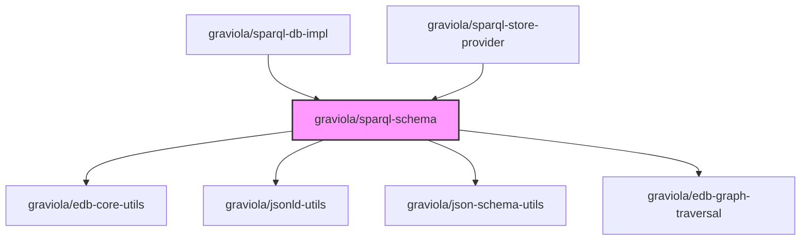

# @graviola/sparql-schema

A utility for converting JSON Schema to SPARQL queries and performing CRUD operations with RDF data.


## Overview

This package provides tools for bridging the gap between JSON Schema and SPARQL, enabling seamless interaction with RDF data stores using familiar JSON Schema definitions. It converts JSON Schema structures to SPARQL queries, handles CRUD operations, and provides utilities for finding and manipulating RDF data.

## Ecosystem Integration

### Position in the Graviola Framework

The sparql-schema package is a core component of the Graviola framework's data layer when using Triple or Quad Stores and SPARQL endpoints. It serves as the bridge between JSON Schema definitions and SPARQL queries, enabling applications to interact with RDF data stores using familiar JSON Schema structures. This package is essential for applications that need to store and retrieve linked data from SPARQL endpoints.

### Dependency Graph



### Package Relationships

- **Dependencies**:

  - `@graviola/edb-core-utils`: Provides utility functions for working with IRIs and other core operations
  - `@graviola/jsonld-utils`: Provides utilities for working with JSON-LD data
  - `@graviola/json-schema-utils`: Provides utilities for working with JSON Schema
  - `@graviola/edb-graph-traversal`: Provides utilities for traversing graph data structures

- **Peer Dependencies**:

  - `@rdfjs/data-model`: RDF/JS data model implementation
  - `@rdfjs/parser-jsonld`: JSON-LD parser for RDF/JS
  - `@tpluscode/sparql-builder`: SPARQL query builder
  - `json-schema`: JSON Schema definitions
  - `jsonld`: JSON-LD processor
  - `jsonld-context-parser`: JSON-LD context parser
  - `n3`: N3.js RDF library (parse and serialize turtle and n-triples)
  - `rdf-dataset-ext`: RDF dataset extensions
  - `string-to-stream`: Convert strings to streams

- **Used By**:
  - `@graviola/sparql-db-impl`: Implements database operations using sparql-schema
  - `@graviola/sparql-store-provider`: Provides a store interface using sparql-schema

## Installation

```bash
bun add @graviola/sparql-schema
# or
npm install @graviola/sparql-schema
# or
yarn add @graviola/sparql-schema
```

## Features

### JSON Schema to SPARQL Conversion

- **jsonSchema2construct**: Convert JSON Schema to SPARQL CONSTRUCT queries
- **jsonSchema2Select**: Convert JSON Schema to SPARQL SELECT queries
- **jsonSchema2constructWithLimits**: Convert JSON Schema to SPARQL CONSTRUCT queries with limits
- **prefixes2sparqlPrefixDeclaration**: Convert prefix mappings to SPARQL PREFIX declarations

### CRUD Operations

- **save**: Save an entity to the RDF store
- **load**: Load an entity from the RDF store
- **remove**: Remove an entity from the RDF store
- **exists**: Check if an entity exists in the RDF store
- **getClasses**: Get all classes from the RDF store
- **moveToTrash**: Move an entity to the trash
- **restoreFromTrash**: Restore an entity from the trash

### Entity Finding

- **findEntityByClass**: Find entities by their class
- **searchEntityByLabel**: Search for entities by their label
- **findEntityByAuthorityIRI**: Find entities by their authority IRI

### SPARQL Query Generation

- **makeSPARQLConstructQuery**: Create a SPARQL CONSTRUCT query
- **makeSPARQLDeleteQuery**: Create a SPARQL DELETE query
- **makeSPARQLWherePart**: Create the WHERE part of a SPARQL query
- **makeSPARQLToTrashQuery**: Create a query to move an entity to trash
- **makeSPARQLRestoreFromTrashQuery**: Create a query to restore an entity from trash

## Usage

### Converting JSON Schema to SPARQL CONSTRUCT Query

```typescript
import { jsonSchema2construct } from "@graviola/sparql-schema";
import { JSONSchema7 } from "json-schema";

// Define a JSON Schema
const schema: JSONSchema7 = {
  type: "object",
  properties: {
    name: { type: "string" },
    age: { type: "number" },
    email: { type: "string" },
  },
  required: ["name"],
};

// Convert to SPARQL CONSTRUCT query parts
const { construct, whereOptionals, whereRequired } = jsonSchema2construct(
  "?person", // Subject variable
  schema, // JSON Schema
);

console.log(construct);
// Output:
// ?person a ?__type_0 .
// ?person :name ?name_1 .
// ?person :age ?age_2 .
// ?person :email ?email_3 .

console.log(whereOptionals);
// Output:
// OPTIONAL { ?person a ?__type_0 . }
// OPTIONAL { ?person :age ?age_2 . }
// OPTIONAL { ?person :email ?email_3 . }
```

### Saving an Entity

```typescript
import { save } from "@graviola/sparql-schema";
import { JSONSchema7 } from "json-schema";

// Define a JSON Schema
const schema: JSONSchema7 = {
  type: "object",
  properties: {
    "@id": { type: "string" },
    "@type": { type: "string" },
    name: { type: "string" },
    age: { type: "number" },
  },
  required: ["@id", "@type", "name"],
};

// Define an entity
const person = {
  "@id": "http://example.org/person/1",
  "@type": "http://example.org/ontology#Person",
  name: "John Doe",
  age: 30,
};

// Save the entity
const sparqlEndpoint = "http://localhost:3030/dataset/sparql";
const sparqlUpdateEndpoint = "http://localhost:3030/dataset/update";

const result = await save({
  entity: person,
  schema,
  sparqlEndpoint,
  sparqlUpdateEndpoint,
});

console.log(result);
// Output: { success: true }
```

### Finding Entities by Class

```typescript
import { findEntityByClass } from "@graviola/sparql-schema";

// Find all Person entities
const sparqlEndpoint = "http://localhost:3030/dataset/sparql";
const persons = await findEntityByClass({
  classIRI: "http://example.org/ontology#Person",
  sparqlEndpoint,
  limit: 10,
  offset: 0,
});

console.log(persons);
// Output: [{ '@id': 'http://example.org/person/1', '@type': 'http://example.org/ontology#Person', name: 'John Doe', ... }, ...]
```

### Searching Entities by Label

```typescript
import { searchEntityByLabel } from "@graviola/sparql-schema";

// Search for entities with label containing "John"
const sparqlEndpoint = "http://localhost:3030/dataset/sparql";
const results = await searchEntityByLabel({
  searchText: "John",
  sparqlEndpoint,
  limit: 10,
  offset: 0,
});

console.log(results);
// Output: [{ '@id': 'http://example.org/person/1', '@type': 'http://example.org/ontology#Person', label: 'John Doe', ... }, ...]
```

## API Reference

### Schema to SPARQL Conversion

#### jsonSchema2construct(subjectURI, rootSchema, stopSymbols?, excludedProperties?, maxRecursion?)

Converts a JSON Schema to a SPARQL CONSTRUCT query.

- **Parameters**:

  - `subjectURI`: The subject URI or variable
  - `rootSchema`: The JSON Schema to convert
  - `stopSymbols?`: Array of property names to stop recursion at
  - `excludedProperties?`: Array of property names to exclude
  - `maxRecursion?`: Maximum recursion depth (default: 4)

- **Returns**: Object with `construct`, `whereRequired`, and `whereOptionals` strings

#### jsonSchema2Select(fields, where, limit?, offset?, orderBy?)

Creates a SPARQL SELECT query.

- **Parameters**:

  - `fields`: Array of field names to select
  - `where`: WHERE clause of the query
  - `limit?`: Maximum number of results
  - `offset?`: Offset for pagination
  - `orderBy?`: Array of fields to order by

- **Returns**: SPARQL SELECT query string

### CRUD Operations

#### save(options)

Saves an entity to the RDF store.

- **Parameters**:

  - `options`: Object with `entity`, `schema`, `sparqlEndpoint`, and `sparqlUpdateEndpoint`

- **Returns**: Promise resolving to the save result

#### load(options)

Loads an entity from the RDF store.

- **Parameters**:

  - `options`: Object with `entityIRI`, `typeIRI`, `schema`, and `sparqlEndpoint`

- **Returns**: Promise resolving to the loaded entity

#### remove(options)

Removes an entity from the RDF store.

- **Parameters**:

  - `options`: Object with `entityIRI`, `typeIRI`, `schema`, `sparqlEndpoint`, and `sparqlUpdateEndpoint`

- **Returns**: Promise resolving to the remove result

## License

This package is part of the Graviola project.
